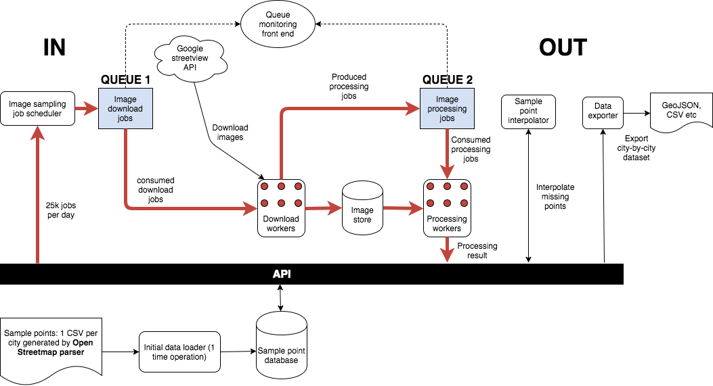
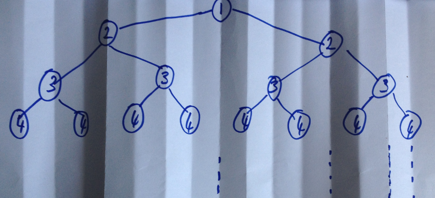

# GONDOLA WISH 

> Distributed street view image processing

[](http://www.repostatus.org/#wip)
[](http://www.nationalarchives.gov.uk/doc/open-government-licence/version/3/)




# Sampling database

## Schema

A MySQL database utilising
[Geospatial extensions](https://dev.mysql.com/doc/refman/5.7/en/spatial-extensions.html)
holds all of the sample points in the following basic schema:

```
mysql> desc sample_points;
+-----------------+----------------------+------+-----+-------------------+-----------------------------+
| Field           | Type                 | Null | Key | Default           | Extra                       |
+-----------------+----------------------+------+-----+-------------------+-----------------------------+
| id              | bigint(20)           | NO   | PRI | NULL              | auto_increment              |
| city            | varchar(255)         | NO   |     | NULL              |                             |
| road_name       | varchar(255)         | NO   |     | NULL              |                             |
| osm_way_id      | bigint(20)           | NO   |     | NULL              |                             |
| sequence        | int(11)              | NO   |     | NULL              |                             |
| bearing         | double               | NO   |     | NULL              |                             |
| geom            | point                | NO   | MUL | NULL              |                             |
| sample_order    | int(11)              | NO   |     | NULL              |                             |
| sample_priority | int(11)              | NO   |     | NULL              |                             |
| ts              | timestamp            | NO   |     | CURRENT_TIMESTAMP | on update CURRENT_TIMESTAMP |
| cam_dir         | enum('left','right') | NO   |     | NULL              |                             |
| predicted       | tinyint(1)           | YES  |     | 1                 |                             |
| value           | double               | YES  |     | 0                 |                             |
+-----------------+----------------------+------+-----+-------------------+-----------------------------+
13 rows in set (0.00 sec)
```

The table consists of 1 row **per sample**: 2 rows for each left and right 
reading at each coordinate. 

Where:

|Field            |Meaning                                                                                                     |
|:----------------|:-----------------------------------------------------------------------------------------------------------|
|id               |A unique ID assigned to each sample point                                                                   |
|city             |One of the 112 major towns and cities the sample belongs to                                                 |
|road\_name       |Name of the road the sample is on                                                                           |
|osm\_way\_id     |Open Street Map road network way id the sample belongs to                                                   |
|sequence         |Order of this sample w.r.t the point along the way id/road                                                  |
|bearing          |Heading in degrees of this point w.r.t previous and next point                                              |
|geom             |Coordinates of this sample, stored as a [WKT](https://en.wikipedia.org/wiki/Well-known_text) POINT(lng lat) |
|sample\_order    |Order in which this sample should be taken                                                                  |
|sample\_priority |Sampling priority for this point (lowest = highest priority)                                                |
|ts               |Timestamp for when this point was sampled or interpoalted                                                   |
|cam\_dir         |Sample direction - currently looking **left** or **right** w.r.t **bearing**                                |
|predicted        |True if this point has been interpolated/predicted, False if an actual reading has been made                |
|value            |The **green** percentage value for this sample point                                                        |

## Initial data load

The code in [infrastructure/mysql](infrastructure/mysql) will import the initial
(unsampled) dataset into mysql. It expects as input the **csv** files for each 
city generated by the 
[trees-open-street-map](https://github.com/datasciencecampus/trees-open-street-map)
module. During import, sample points will be assigned a **sampling priority** as
described below.

## Sampling priority

There are 418,941 unique 
[osm way](http://wiki.openstreetmap.org/wiki/Elements#Way) ids/roads for the 112
major towns and cities in England and Wales. If sampling at 10 metre intervals, 
this will result in 8,315,247 coordinates, or 16,630,494 sample points if 
obtaining a **left** and **right** image at each point. With an image download
quota of 25k images per day, this equates to ~2 years of overall processing 
time. (halfed for each API key or 6 months with 100k images per day premium 
plan).

**A key requirement of this project is a complete dataset**

Missing points have been interpolated/predicted using **IDW** (details below).
Since it has been assumed that points closer to one another will exhibit a 
higher correlation, it makes sense to sample points which are maximally further
appart. A naive sampling scheme would simply sample random points across a city
in a uniform fashon. It has been assumed that by **guiding** the sampling 
process as to **maximise** information gain, we can **obtain a higher accuracy 
dataset faster** than a random sampling method: In a random sampling scheme, it
is possible to sample 2 adjacent points which will do little to reduce the 
overall error if sampling points are spatialy correlated.

In the case of sampling points along a road, this corresponds to a 1-
dimensional *maximally distant* sampling problem. For example, given a road 
indexed by (pending) sample points:

```
[01 02 03 04 05 06 07 08 09 10 11 12 13 14 15]
```

If restricted to 1 sample per day, we could sample each point at random for 15
days, or proceed from lest to right. Instead, it is desirable to sample points
with maximum information gain as their sampled values will be propogated to 
neighbours via the inverse distance weighting scheme. As such, the 15 indices
should be visited according to this schedule:

```
[08 04 12 02 06 10 14 01 03 05 07 09 11 13 15]
```

Where the middle (08) "pivot" point is visited first, point 04 second and so on.
The idea is to assign a sampling priority to each point which corresponds to a
"fold depth" if the list were to be continuously folded in half like a piece of
paper:



To solve this problem, each paper fold can be seen as a *depth* in a 
*binary tree*. As such, the [algorithm](generic/sequence.py) used to assign
sampling priority to points traverses the list as if it were a tree in
[breadth first search](https://en.wikipedia.org/wiki/Breadth-first_search)
order.

```
                     01
         02                      03
   04          05          06          07
08    09    10    11    12    13    14    15

```

For more details, also see the [unit test](generic/test_sequence.py).

Points on each road are assigned a priority using 
[this](infrastructure/mysql/add_priority.py) script before database insertion.

# Image processing API


# Image processing pipeline

The image processing pipeline is divided by a number of network based FIFO
queues and worker processes. The objective is to separate the image sampling and
processing logic whilst keeping track of sampling state. The end-to-end pipeline
allows for complete control and flexibility over the sampling process.

## Layer 1

This layer consumes unsampled data points from the image processing API and 
either: Places image download **jobs** directly onto the 
**image\_download\_jobs** queue (option 1) or sends jobs to individual queues
for each city (option 2). 

### Option 1: Quota based data load

25,000 pending sample points are selected from the image processing API ordered
by their **sampling priority**.

### Option 2: City queue data loader

The **data loader** module is run on an ad-hoc basis. It consumes from the image
processing API and inserts a batch of work onto the first layer of **queues**.

#### City queues and "Jobs"

At this level, there is 1 (persitent) queue per city. This allows for maximum
flexibility and easy monitoring of image processing status. Each queue contains
a number of **jobs**, where each job is defined as follows:

```json
{
  "id": 123,
  "city": "Cardiff",
  "road_name": "Clydesmuir Road",
  "osm_way_id": "24005721",
  "sequence": "000057",
  "latitude": 51.491386,
  "longitude": -3.141202,
  "bearing": 46.48,
  "cam_dir": "left"
}
``` 

The job structure is used throughout the processing pipeline.

## Layer 2

### Job scheduler

This (optional) module sits between the initial backlog\* queues and the current
work queue(s). It is both a consumer and producer of jobs. It's purpose is:

1. Control the job processing bandwidth. E.g., shovel a max quota of jobs onto
the current work queue per day.

2. Control the processing progress for each city. E.g., the city queues may be
consumed on a [round robin](https://en.wikipedia.com/wiki/Round-robin) basis,
in which case smaller cities will complete first. Or, jobs may be selected
using a weighted priority scheme, in which case the number of jobs selected from
each city is proportionate to the size of the city.

3. Processing flexibility. Jobs can be shoveled to different queues on an ad
-hoc basis or if processing restrictions change (e.g., different quota, the
addition of extra processing nodes or some form of load balancing proxy.

As such, the job shovel can be thought of as a 
[job scheduler](https://en.wikipedia.com/wiki/Job_scheduler).

Note that this layer can by skipped if the 
[data\_load/initial.sh](data_load/initial.sh) has not been used in Layer 1.

## Layer 3

### Image downloader

This layer consists of 1 or more processes dedicated to downloading images from
the [Google street view image API](https://developers.google.com/maps/documentation/streetview/).
As a prerequisite, a Google developer key must first be obtained which will be
associated with a quota of 25,000 daily image downloads.

25,000 40k images = ~1G per day, and since we must request each image 
individualy, this can take some time. As such, besides separating image 
acquisition and processing logic, the main purposes of this layer are:

* **Parallelisation** of image downloads. Can speed up download process and also
distribute the effort amongst different network nodes which may be making use of
different API keys, thus increasing the daily download quota. Disclaimer: this
would most likely be in breach of the API terms-and-conditions. Note that each 
download process also makes use of persistent HTTP connections.

* **Control**. It is possible to start, stop and control the download throughput
by adding/removing processes to/from the pool.

The process blocks on the **image\_download\_jobs** queue until a new job 
arrives. Note that this behaviour can follow a scheme - see 
[image\_download/download.sh](download.sh) for details.

Upon receiving a new image download job, the process will make a request for a 
street-view image ata specific location and direction according to the 
parameters in the download job. In addition, a second request is made to the 
street-view API for associated image meta data which includes the month/year in 
which the image was obtained.

Each downloaded image is stored locally (although chould be pushed to an 
external store) and then an **image processing** job is generated and pushed to
the **image\_processing\_jobs** queue where it will live until consumed by 
workers in layer 4.

Having consumed the image download job **if** everything went as planned, the
job is deleted from the incoming queue. Otherwise, the job is marked as 
"buried" as not to loose any samples and to assist in debugging/error 
reproduction. Using a queue administration interface (see below), it is then 
possible to flush or move buried jobs back onto the active queue after having 
resolved the issue.

## Layer 4

### Image processor

This layer consists of 1 or more processes dedictated to image processing. At an
abstract level, an image processing process is both a consumer and a producer. 
Image processing jobs are **consumed** from the **image\_processing\_jobs** 
queue, processed and then the result is **pushed** to the 
**image processing API**. As such, the image processing stages can be divided up
into 3 sub-steps:

#### Consumption

The process blocks on the **image\_processing\_jobs** queue according to a 
*consumption scheme* which defines how much work the process will do before self
terminating. Specifically, the worker process will consume tasks until:

* **Forever**: Block on queue forever, processing jobs when they arrive.
* **Queue is empty**: Drain the queue until it is empty.
* **Maximum work load**: Do **N** many jobs as long as there exists work.

The format of a consumed job is exactly the same as a JSON image download job as
described above. Upon receiving a job, the image processor will obtain the 
corresponding image from the image store:

`downloaded_images`/`city`/`road`/`osm_way_id`/{`left`,`right`}/`sequence`\_`lat`\_`lon`\_`id`.jpg 

Note that the image could be located locally or as a network resource.

#### Processing

The next step is to quantify the amount of vegetation present in the image. 

Currently, the image is first converted to the L\*a\*b\* colour space. Lab is 
better suited to image processing tasks since it is much more intuitive than 
RGB. In Lab, the lightness of a pixel (L value) is seperated from the colour 
(A and B values). A negative A value represents degrees of green, positive A, 
degrees of red. Negative B represents blue, while positive B represents yellow. 
A colour can never be red *and* green or yellow *and* blue at the same time. 
Therefore the Lab colour space provides a more intuitive seperability than RGB 
(where all values must be adjusted to encode a colour.) Furthermore, since 
lightness value (L) is represented independently from colour, a 'green' value 
will be robust to varying lighting conditions.

The actual amount of vegetation present in the scene is defined to be the ratio
of *green* pixels in the overall image. Although it is possible to plug-in 
other metrics at this stage.

#### Production

The results from image processing are then pushed to the image processing API.
Currently, the amount of green is pushed via a HTTP POST request to the 
following end-point:

`http://server_ip:port/api/sample/<sample_id>`

With the following from:

```
value=<green_percent>
```

Having pushed the image processing results, the worker then deletes the job from
the queue and then repeats the cycle.

### Running the image processor

Whilst the image processing script is invoked from a higher level script, it is
possible to run it independently by invoking the 
[image\_processor.sh](image_processing/image_processor.sh) script, which in turn
will invoke:

```
python3 ./image_processor.py WORKER_NAME SCHEME SRC_QUEUE SRC_STORE
```

Where `WORKER_NAME` = name of process, `SCHEME` = -1, 0, or N according to the
consumption scheme described above, `SRC_QUEUE` = name of the incomming job 
queue and `SRC_STORE` = (local) directory where downloaded images have been 
stored.


# Sample point interpolation

Since we are restricted to downloading 25,000 images per day, we can predict
missing values for non-sampled points.

For **green** percentage, it has been assumed that *there exists a spatial 
relationship between each point*: It is likely that points closer together are 
likely to be similar. Furthermore, it has been assumed that this relationship
is stronger for points on the same road and even stronger still for points on
the same side of the road. This is typically the case for roads with *rows* of
trees, stretches of park/woodland and for linear features such as hedgerows.

When interpolating/predicting missing points there exist many schemes (for
example mean N-nearest neighbour). However, given the above assumption, missing
sample points along a road are predicted according to the 
[Inverse Distance Weighting](https://en.wikipedia.org/wiki/Inverse_distance_weighting)
of sampled values of the nearest *left* and *right* points: 
`predicted = (1-w)*left + w*left` where `w = [0, 1]`: distance along line between
`left` and `right` sample points. -- See code+unit tests in
[interpolator/](interpolator/) for details.

After all 25,000 images for a day have been downloaded and processed, the
[interpolator](interpolator) will predict the missing points for the entire
dataset. As such:

* The "resolution" of the dataset will **improve** over time as more samples are 
  collected.
* It is expected that the **prediction error** will reduce over time as sampled
  points become closer according to the sampling prioritisation scheme. It is
  likely that sampling at lower distances may not reduce error at all.
* The dataset will always be **complete** despite the number of reminaing 
  samples. 

# Running

The end-to-end processing process can be invoked as a one-shot daily task. The
[daily\_run.sh](daily_run.sh) script can be invoked with no arguments and is a
good starting point to understand the overall flow of the system.

To invoke once per day using **Layer 1, Option 1** the following cron-job could
be created: `crontab -e`

```
30 21 * * * daily_run.sh 1 >> run.log 2 >> run.err
```

If using **Option 2** (inidivdual queues per city), the 
[shovel/fair\_scheduler.sh](shovel/fair_scheduler.sh) script could be invoked in
the same way.

Note that option (1) is most suitable for very large datasets, since beanstalkd
is an **in-memory** store.

# Monitoring

Besides [Beanstalkd's protocol](https://github.com/kr/beanstalkd/blob/master/doc/protocol.txt),
there exist a number of 
[queue monitoring and admin tools](https://github.com/kr/beanstalkd/wiki/Tools).
[Aurora](https://github.com/xuri/aurora) is a nice (web based) tool which allows
for monitoring **and** manipulation of queue states - E.g., the ability to move
jobs around queues. And for the CLI, 
[beanwalker](https://github.com/kadekcipta/beanwalker) is a nice Go based tool.
Both tools have been used in this project.


# Dependencies

## OS

* [beanstalkd](https://github.com/kr/beanstalkd) for queues.
* Mysql (with GIS Spatial extentions)

## Python
```
sudo pip3 install requests
sudo pip3 install beanstalk
sudo pip3 install pystalkd
sudo pip3 install opencv-python
```

# Licence
Open Government license v3 [OGL v3](http://www.nationalarchives.gov.uk/doc/open-government-licence/version/3/).
